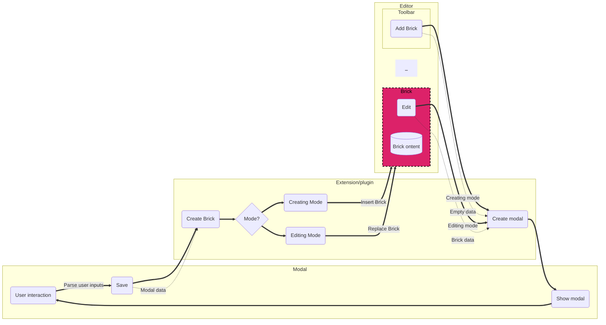

# Summernote heading
summernote-heading extension/plugin/module for [summernote](https://github.com/summernote/summernote/) WYSIWYG, provides a bootstrap modal to add custom heading to the summernote editor.

Font-awesome: 4.7
JQuery: 3
Bootstrap version: 4
Summernote version: 0.8

**For a complete module with more user-friendly components. see [Summernote bricks](https://github.com/eissasoubhi/summernote-bricks)**

### More summernote extensions (SNB bricks)
 - [Summernote Gallery](https://github.com/eissasoubhi/summernote-gallery)

# Demo

Demo link:
http://eissasoubhi.github.io/summernote-heading <br><br>


# Installing
- Include the required files, and the module file after summernote-bs4.min.js file

```html
<link href="https://stackpath.bootstrapcdn.com/font-awesome/4.7.0/css/font-awesome.min.css" rel="stylesheet" >
<link rel="stylesheet" href="https://cdn.jsdelivr.net/npm/bootstrap@4.6.1/dist/css/bootstrap.min.css">
<link href="https://cdn.jsdelivr.net/npm/summernote@0.8.18/dist/summernote-bs4.min.css" rel="stylesheet">

<!-- summernote-heading style-->
<link rel="stylesheet" href="summernote-bricks.css">

<div style="background-color: #FFF">
    <div id="summernote"></div>
</div>

<script src="https://code.jquery.com/jquery-3.5.1.min.js"></script>
<script src="https://cdn.jsdelivr.net/npm/popper.js@1.16.0/dist/umd/popper.min.js"></script>
<script src="https://stackpath.bootstrapcdn.com/bootstrap/4.4.1/js/bootstrap.min.js"></script>
<script src="https://cdn.jsdelivr.net/npm/summernote@0.8.18/dist/summernote-bs4.min.js"></script>

<!-- summernote-heading -->
<script src="dist/summernote-heading.min.js" type="text/javascript"></script>
```
- Add the heading to the summernote editor toolbar

```javascript
$('#summernote').summernote({
        toolbar: [
            // ['insert', ['picture', 'link', 'video', 'table', 'hr', 'summernoteHeading']],
            // ['font style', ['fontname', 'fontsize', 'color', 'bold', 'italic', 
            //'underline', 'strikethrough', 'superscript', 'subscript', 'clear']],
            // ['paragraph style', ['style', 'ol', 'ul', 'paragraph', 'height']],
            // ['misc', ['fullscreen', 'codeview', 'undo', 'redo', 'help']]
            ['extensions', ['summernoteHeading']],
        ],
        summernoteHeading: {
            modal: {
                // modal title
                title: 'Summernote Heading title',

                // close button text
                closeText: 'Close',

                // save button text
                saveText: 'Save',

                // title input label text
                titleLabel: 'Heading title',

                // title input label text
                subtitleLabel: 'Heading subtitle',

                // the html element class containing the modal messages
                messageContainerClass: 'snb-modal-message',

                // the default value of the underline color input
                defaultUnderlineColor: '#c50000',

                // the text of the label of the underline color input
                underlineColorLabel: 'Underline color',

                // modal inputs validations
                validations: {
                    "title": ["required"],
                    "subtitle": ["required"]
                },
            },

            buttonLabel: '<i class="fa fa-header"></i> SNB Heading',

            tooltip: 'Summernote Heading',

            extensions: [
                // add/remove linebreaks extension
                'snbWhiteSpaceManager'
            ]
        }
    });
```

# Options

The module has general options and modal options.<br>
The `modal` option has sub-options that deal with the bootstrap modal.<br>

| Option                      | Description                                                                            | Default                                 | Type                                                            |
|-----------------------------|----------------------------------------------------------------------------------------|-----------------------------------------|-----------------------------------------------------------------|
| buttonLabel                 | the plugin button label displayed on the summernote toolbar                            | <i class="fa fa-header"></i> SN Heading | string                                                          |
| tooltip                     | the plugin button tooltip visible on the button hover event                            | Summernote Heading                      | string                                                          |
| extensions                  | extension to add extra features to the brick (see the SNB-extension section)           | ['snbWhiteSpaceManager']                | array                                                           |
| **modal**                   | The modal options                                                                      | -                                       | object: `src/Module/Interfaces/HeadingModalOptionsInterface.ts` |
| modal.title                 | The modal title                                                                        | summernote heading title                | string                                                          |
| modal.closeText             | the modal close button text                                                            | Close                                   | string                                                          |
| modal.saveText              | the modal save button text                                                             | Save                                    | string                                                          |
| modal.titleLabel            | the label text of the heading title input                                              | Heading title                           | string                                                          |
| modal.subtitleLabel         | the label text of the heading subtitle input                                           | Heading subtitle                        | string                                                          |
| modal.messageContainerClass | the class of the html element containing the modal messages                            | snb-modal-message                       | string                                                          |
| modal.defaultUnderlineColor | the default color of the heading underline in hexa format                              | #c50000                                 | string                                                          |
| modal.underlineColorLabel   | the label text of the underline color input                                            | Underline color                         | string                                                          |
| **modal.validations**       | Validation of the modal/brick data: `src/Module/Interfaces/HeadingDataInterface.ts`    | -                                       | object                                                          |
| modal.validations.title     | the validation rules of the `src/Module/Interfaces/HeadingDataInterface.ts` title      | ["required"]                            | array                                                           |
| modal.validations.subtitle  | the validation rules of the  `src/Module/Interfaces/HeadingDataInterface.ts`  subtitle | ["required"]                            | array                                                           |

# Deep dive || Edit

**Requirements: node v16**

### Dev environment setup
To run the plugin on local, head to the project root folder and run:
1. `npm install`
2. `npm run start` to start the project on 127.0.0.1:9091
3. `npm run dev` to start the webpack watch mode
4. Edit plugin files in the `/src` folder 
5. `npm run build` to generate the build in `/dist` folder

### The source code
The module is coded with Typescript and JSX

JSX is for writing single-file template files residing in `src/Module/templates`

Some components of this code source are imported from the SNB-components package
### How it works:



### SNB Extensions:
SNB Extensions are a way to extract some reusable features to be included later (or not) by any Summernote-brick

See the available SNB extensions [here](https://github.com/eissasoubhi/SNB-components#readme)

### Contribution
If you found any bugs or have suggestions, don't hesitate to throw it in the issues sections.

For more understanding of how this module works take a look on the [v1](https://github.com/eissasoubhi/summernote-gallery/tree/v1) branch or the summernote extension basic sample [hello](https://github.com/summernote/summernote/blob/v0.7.0/examples/plugin-hello.html) .

# License
The contents of this repository is licensed under [The MIT License.](https://opensource.org/licenses/MIT)
