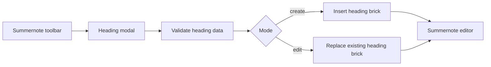

# Summernote Heading

Summernote Heading is a standalone [Summernote](https://github.com/summernote/summernote) plugin for creating and editing reusable heading blocks with a modal form.

It is also one of the official plugins that can be composed by [Summernote Bricks](https://github.com/eissasoubhi/summernote-bricks), but **Summernote Bricks is not required** to use Heading.

## Features

- create structured heading blocks from a modal;
- edit an inserted heading through the shared SNB brick lifecycle;
- configurable title/subtitle and underline color;
- validation rules for modal data;
- optional reusable SNB extensions such as whitespace management;
- standalone Summernote toolbar integration.

## Demo

The historical demo is available at:

https://eissasoubhi.github.io/summernote-heading


## Install

```bash
npm install summernote-heading
```

The package exposes two intended consumption paths:

- module entry: `dist/module/index.js`;
- browser bundle: `dist/summernote-heading.min.js`.

### Browser usage

The current demo integration uses Bootstrap 4:

```html
<link rel="stylesheet" href="https://cdn.jsdelivr.net/npm/bootstrap@4.6.1/dist/css/bootstrap.min.css">
<link rel="stylesheet" href="https://cdn.jsdelivr.net/npm/summernote@0.8.18/dist/summernote-bs4.min.css">
<link rel="stylesheet" href="node_modules/summernote-heading/summernote-bricks.css">

<div id="summernote"></div>

<script src="https://code.jquery.com/jquery-3.5.1.min.js"></script>
<script src="https://cdn.jsdelivr.net/npm/popper.js@1.16.0/dist/umd/popper.min.js"></script>
<script src="https://stackpath.bootstrapcdn.com/bootstrap/4.6.1/js/bootstrap.min.js"></script>
<script src="https://cdn.jsdelivr.net/npm/summernote@0.8.18/dist/summernote-bs4.min.js"></script>
<script src="node_modules/summernote-heading/dist/summernote-heading.min.js"></script>
```

Add `summernoteHeading` to the toolbar:

```js
$('#summernote').summernote({
  toolbar: [
    ['extensions', ['summernoteHeading']]
  ],
  summernoteHeading: {
    buttonLabel: '<i class="fa fa-header"></i> Heading',
    tooltip: 'Add heading',
    extensions: ['snbWhiteSpaceManager'],
    modal: {
      title: 'Create heading',
      closeText: 'Close',
      saveText: 'Save',
      titleLabel: 'Heading title',
      subtitleLabel: 'Heading subtitle',
      defaultUnderlineColor: '#c50000',
      underlineColorLabel: 'Underline color',
      validations: {
        title: ['required'],
        subtitle: ['required']
      }
    }
  }
});
```

## Main options

| Option | Purpose | Default |
| --- | --- | --- |
| `buttonLabel` | Toolbar button HTML/text | Heading label |
| `tooltip` | Toolbar tooltip | `Summernote Heading` |
| `extensions` | Reusable SNB extensions enabled for the brick | `['snbWhiteSpaceManager']` |
| `modal.title` | Modal title | `summernote heading title` |
| `modal.closeText` | Close button label | `Close` |
| `modal.saveText` | Save button label | `Save` |
| `modal.titleLabel` | Title input label | `Heading title` |
| `modal.subtitleLabel` | Subtitle input label | `Heading subtitle` |
| `modal.defaultUnderlineColor` | Initial underline color | `#c50000` |
| `modal.underlineColorLabel` | Underline color input label | `Underline color` |
| `modal.validations` | Validation rules for heading data | required title/subtitle |

The TypeScript interfaces under `src/Module/Interfaces` are the canonical reference while the public documentation is being modernized.

## How it works


```mermaid
flowchart LR
    Toolbar[Summernote toolbar] --> Modal[Heading modal]
    Modal --> Data[Validate heading data]
    Data --> Mode{Mode}
    Mode -->|create| Insert[Insert heading brick]
    Mode -->|edit| Replace[Replace existing heading brick]
    Insert --> Editor[Summernote editor]
    Replace --> Editor
```

The plugin is intentionally split between Heading-specific behavior and reusable SNB runtime behavior. Shared modal, validation, editor and extension concepts belong in `snb-components` rather than being duplicated here.

## Compatibility

The existing browser demo is based on Summernote 0.8.18 + Bootstrap 4. That is the **known historical integration**, not a full current compatibility matrix.

The ecosystem modernization work is adding explicit browser coverage. Bootstrap 5 requires a shared modal adapter because the current SNB runtime still calls Bootstrap's jQuery modal API.

See [summernote-bricks#3](https://github.com/eissasoubhi/summernote-bricks/issues/3) for the cross-package roadmap.

## Development

Use an active Node LTS release. CI currently validates Node 22 and 24.

```bash
npm ci
npm run typecheck
npm run build
npm test
npm pack --dry-run
```

Run the demo locally:

```bash
npm run start
```

Watch TypeScript changes:

```bash
npm run dev
```

See [`CONTRIBUTING.md`](CONTRIBUTING.md) for contribution rules and [`SECURITY.md`](SECURITY.md) for vulnerability reporting.

## Designing future heading features

Keep persisted HTML stable when possible. If the brick data or generated markup must change, provide a migration strategy before release because applications may already store editor HTML containing Heading bricks.

New reusable behavior should become an SNB extension/shared runtime capability rather than a Heading-only copy.

## License

MIT — see [`LICENSE`](LICENSE).
